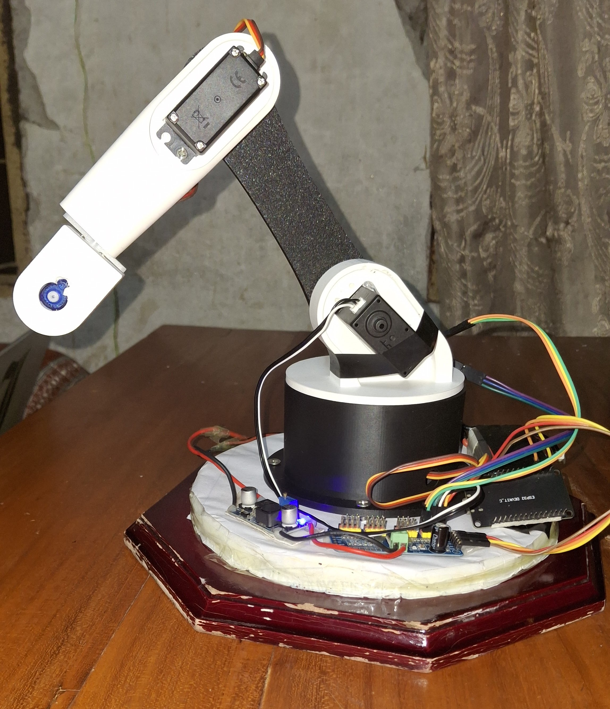
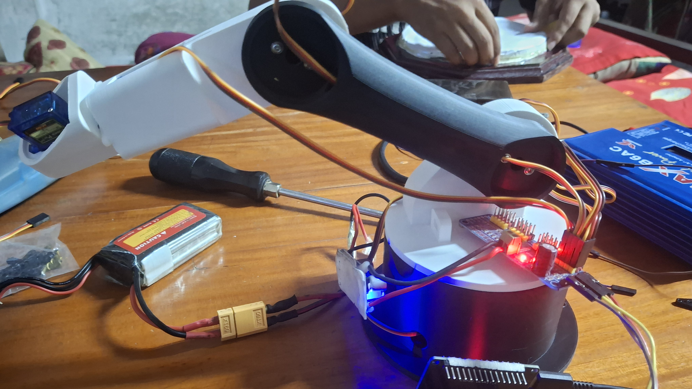

# ESP32 Robotic Arm - Web-Controlled, WiFi-Native

**Course:** CSE 3106 - Embedded Systems & Internet of Things


**Group members (roll numbers):** 2207093, 2207096, 2207097, 2207120

A 6-joint robotic arm controlled entirely over WiFi from a browser - no app,
no companion software. The ESP32 hosts its own web page, streams live joint
state over WebSocket, and drives servos through a PCA9685 PWM driver.

## Media

### Videos
- **Project demo:** [Watch on Google Drive](https://drive.google.com/file/d/1-gD6HYB_wUxXoMm8oFtJcCvovaT6Efb8/view?usp=sharing)
- **Control the Arm using API - Used *Postman* for testing (merged with other group):** [Watch on Google Drive](https://drive.google.com/file/d/11pC7q9-a4dALDtFa4gt1tf8cy5Px3Xyf/view?usp=drive_link)

### Images
| | |
|---|---|
|  |  |

## Features
- **Wireless control** - ESP32 opens its own WiFi access point (or joins
  home WiFi); control the arm from any phone/laptop browser on that network.
- **Live web UI** - served directly from the ESP32's flash, no internet or
  external hosting needed. Jog buttons per joint, live angle readout.
- **Real-time state sync** - WebSocket pushes joint angles to every
  connected client as the arm moves.
- **REST API** - `POST /api/move` and `POST /api/home` for programmatic
  control (scripting, external dashboards, automation).
- **6 independent joints** - mixed servo types (see Hardware) handled
  through one uniform `Joints` interface.
- **Home / stop safety commands** - recover a known pose or halt motion
  from the UI at any time.

## System architecture
```
 Browser (phone/laptop)
        │  HTTP + WebSocket (WiFi)
        ▼
 ┌───────────────────────────────┐
 │            ESP32               │
 │  AsyncWebServer + WebSocket    │
 │  command routing (RoboticArm.ino)
 │  servo motion engine (servo_control.cpp)
 └───────────────┬────────────────┘
                  │ I2C (SDA/SCL)
                  ▼
 ┌───────────────────────────────┐
 │           PCA9685              │
 │      16-channel PWM driver     │
 └───────────────┬────────────────┘
                  │ PWM per channel
                  ▼
        6x Servos (J1–J6)
```

See [wiring_diagram.svg](wiring_diagram.svg) for the full wiring layout.

## Hardware
| Joint | Motion | Servo |
|-------|--------|-------|
| J1 base (yaw) | 360° continuous | MG996 |
| J2 shoulder | 180° positional | MG996 |
| J3 elbow | 360° continuous | MG996 |
| J4 wrist | 180° positional | SG90 |
| J5 grip/roll | 180° positional | SG90 |
| J6 auxiliary | 180° positional | SG90 |

- **MCU:** ESP32 Dev Module
- **PWM driver:** PCA9685 (I2C, address `0x40`)
- **Servo power:** separate 5–6V, ≥5A supply - **not** from the ESP32 5V pin
  (four+ servos can spike past 5A combined). Common ground required between
  supply, PCA9685, and ESP32.

## Software
- **Firmware:** Arduino/C++ on ESP32
- **Libraries:** ESPAsyncWebServer + AsyncTCP (me-no-dev), ArduinoJson
  (Benoit Blanchon), Adafruit PWM Servo Driver Library
- **Frontend:** vanilla HTML/CSS/JS, embedded in flash via `webpage.h`
- **Protocol:** WebSocket for live state, REST (`/api/move`, `/api/home`)
  for commands

## Wiring
```
ESP32          PCA9685
 3V3  ───────── VCC   (logic power)
 GND  ───────── GND
 21(SDA) ────── SDA
 22(SCL) ────── SCL

PCA9685 V+  ◄── EXTERNAL 5–6V supply (servo power, NOT from ESP32)
PCA9685 GND ─── EXTERNAL supply GND  ── AND ── ESP32 GND   (COMMON GROUND, required)

Servo channel map (PCA9685 outputs):
  0 = J1 base   1 = J2 shoulder   2 = J3 elbow   3 = J4 wrist   4 = J5 grip   5 = J6 aux
```

### ⚠ Power - read this
- MG996 stalls at **~1–2.5 A each**. Multiple servos moving together can
  spike **>5 A**. **Never** run servo V+ from the ESP32 5V pin - it will
  brown-out and reset, or die.
- Use a separate **5–6V ≥5A** supply into PCA9685 **V+**.
- **Common ground** between that supply, the PCA9685, and the ESP32 - or
  servos jitter / signals float.
- Add a large capacitor (**1000µF**) across V+/GND at the PCA9685 to absorb
  spikes.

## Repository layout
| Path | Purpose |
|------|---------|
| `RoboticArm.ino` | Main firmware - WiFi, web server, WebSocket, command routing |
| `config.h` | All calibration - pins, servo trim, direction, angle limits |
| `servo_control.cpp/.h` | PCA9685 drive, positional + open-loop timed motion |
| `webpage.h` | Control web page (HTML/CSS/JS embedded in flash) |
| `wiring_diagram.svg` | Full wiring diagram |
| `calibration_all/` | Standalone sketch - sweeps/tests all 4 original servos via PCA9685 |
| `calibration_j2/` | Standalone sketch - isolates one positional servo channel for calibration |

## Setup

### 1. Wire it up
Follow the [Wiring](#wiring) section and [wiring_diagram.svg](wiring_diagram.svg).
Power servos from a dedicated external supply - do not skip the common
ground.

### 2. Install libraries (Arduino IDE → Library Manager)
- **ESPAsyncWebServer** + **AsyncTCP** (me-no-dev)
- **ArduinoJson** (Benoit Blanchon)
- **Adafruit PWM Servo Driver Library**

Board: install **"esp32 by Espressif"** in Boards Manager, then select
**ESP32 Dev Module**.

### 3. Configure (`config.h`)
Set WiFi mode (`USE_WIFI_AP`), AP credentials or home WiFi SSID/password,
and per-joint direction/offset/limits to match your build.

> `config.h` in this repo ships with placeholder network values - replace
> `STA_SSID`/`STA_PASS` with your own if using station mode, and don't
> commit real credentials to a public repo.

### 4. Flash & connect
1. Open `RoboticArm.ino` in Arduino IDE (keep all files in the same folder).
2. Select your ESP32 board + port, Upload.
3. Open Serial Monitor @115200 - it prints the connection URL.
   - Default = **Access Point** `RoboArm` / pass `12345678`. Connect your
     phone/laptop to that WiFi, open **http://192.168.4.1/**.
   - To join home WiFi instead, set `USE_WIFI_AP 0` and your SSID/PASS in
     `config.h`.

### 5. Calibrate
Use `calibration_all/` and `calibration_j2/` to verify each servo channel
independently before relying on the main firmware. Then, on the main
firmware:
1. **Positional servos (J2, J4–J6).** Jog to a known pose in the web UI. If
   a joint moves the wrong way, flip its `_DIR`. If zero is off, adjust its
   `_OFFSET_DEG` so math-0° matches the physical reference pose.
2. **Continuous servos (J1, J3) speed.** Jog +90°, time how long the joint
   actually takes, then set `J1_DEG_PER_SEC`/`J3_DEG_PER_SEC = 90 / seconds`.
   These are **open-loop** - angle is estimated from elapsed time and
   **drifts** over use. Physically home the joint and use **Set home** in
   the UI when it strays.
